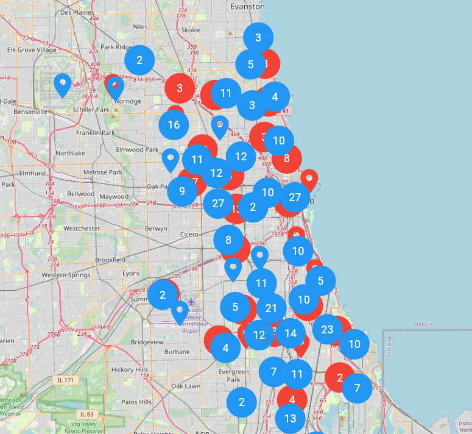
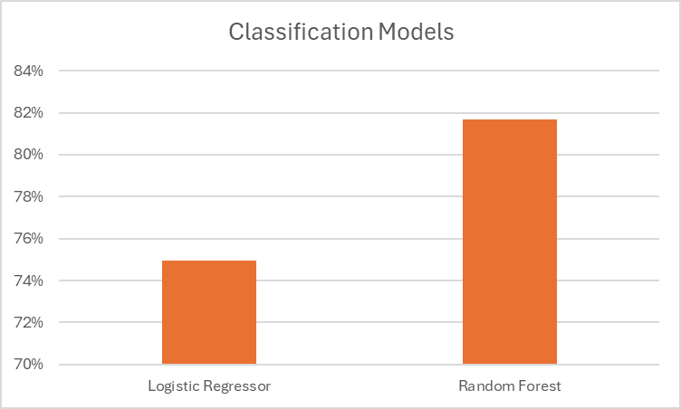
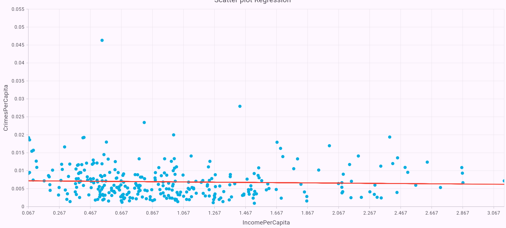

# BigDataProject

## Introduction

The goal of this project was to develop an application capable of performing aggregate queries on a dataset related to crimes reported in the city of Chicago, available on the [Chicago Data Portal](https://data.cityofchicago.org/).  
This online service provides public access to detailed records of criminal incidents starting from 2001. The dataset is updated regularly and contains information on various types of crimes, excluding homicides (for which data is only available for the victims). 

The data, extracted from the Chicago Police Department's CLEAR system, does not disclose exact addresses but instead reports incidents at the block level to protect individual privacy.  
In addition to the data extracted from the Chicago Data Portal, it was also necessary to obtain information on the income and population of Chicago's community areas (to calculate the per capita income for each area). This data is available on the [Chicago Health Atlas](https://chicagohealthatlas.org/) website.

The purpose of the queries and the corresponding services exposed by our application is to conduct an exploratory analysis of this dataset, aiming to derive meaningful insights regarding crime patterns in Chicago.  
Specifically, the application was designed to extract relevant information from the crime data, build predictive models, and provide a web interface to explore and visualize the results.

## Task

The implemented task in this project could be divided in two partitions:

1) SQL-like queries
2) Machine learning prediction models

### SQL-like queries

The SQL queries aim to extract useful information from the dataset.  
They are simple queries designed to answer the following five questions:

1. **Crimes per Year**  
2. **Crime Category Distribution in a Particular Month**  
3. **Domestic Crimes in a Specific Community Area**  
4. **Theft Type Distribution** (high, low, non-theft crimes) in a Specific Community Area  
5. **Crimes per Year for a Selected Community Area and Location** (e.g., street, apartment, etc.)


### Machine-Learning data

The machine learning methods used in this project aim to extract useful information from the dataset.  
Some models are not strictly predictive; for example, clustering methods simply partition the macro areas of crimes based on geographical coordinates.

The implemented models can be summarized as follows:

- **Clustering**:  
  Used to divide the city into clusters based on the geographical coordinates of crimes. This method is not predictive but exploratory, helping to understand the spatial distribution of incidents.

- **Classification**:  
  Aimed at predicting whether an arrest will be made for a given crime. The model uses features such as Community Area, Month, and Crime Category to predict the arrest outcome (binary classification: arrest or no arrest).  
  Two algorithms were trained for this task:
  1) Logistic Regression
  2) Random Forest

- **Regression**:  
  Designed to analyze the correlation between per-capita income and per-capita crime rates. This model is intended for inference rather than prediction, aiming to explore possible relationships between economic factors and crime levels.

## Technical implementation

For the technical implementation, it was necessary to define an Apache Spark distributed engine using scala languagae.  
The frontend provided a simple way to visualize the information extracted from the dataset by the backend.

### Backend

The backend was developed in Scala using the [**Cask**](https://com-lihaoyi.github.io/cask/) framework to handle REST operations.
To run the backend, it is necessary to:

1. Build the project using the `build.sbt` file.
2. Use **Java 17**.
3. Add the following options to **VM options** in "Edit Configuration":
 *--add-exports java.base/sun.nio.ch=ALL-UNNAMED --add-opens java.base/java.nio=ALL-UNNAMED --add-opens java.base/java.lang=ALL-UNNAMED --add-opens java.base/java.lang.invoke=ALL-UNNAMED --add-opens java.base/java.util=ALL-UNNAMED*
4. Download the file ```Crimes_-_2001_to_Present.csv``` from the [Chicago site](https://data.cityofchicago.org/Public-Safety/Crimes-2001-to-Present/ijzp-q8t2/about_data) and put it in the data folder along with the other csv file `Chicago Health Atlas Data - MeanIncome - Mean population.csv`

### Frontend

The frontend was developed using the **Flutter** framework.  
To visualize the results, the following libraries were used:

1. **Flutter Map**:  
   Used to display the map of Chicago and show the crime locations.

2. **Syncfusion Chart**:  
   Used to display the necessary plots and charts.

## Results and visualization example

This section aims to discuss some of the results obtained in this project.
All the defined queries can be visualized using the backend and frontend available in this repository.

### Classification

The classification task is visualized in two ways:

1. **Flutter Map**:  
   - Blue markers represent correct predictions.  
   - Red markers represent incorrect predictions.

2. **Syncfusion Column Chart**:  
   - Displays the number of correct and incorrect predictions.



> **Note:** The number of predictions is limited to 5,000 for visualization purposes.

Two models were trained for the classification task.  
The results show that the **Random Forest classifier** outperformed the **Logistic Regressor** in terms of accuracy.



### Regression

The regression results are visualized using a **Syncfusion scatter plot** with a fitted linear regression line.  
From the plot, it is evident that there is **no significant correlation** between the number of crimes and income per capita.




